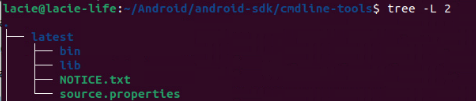
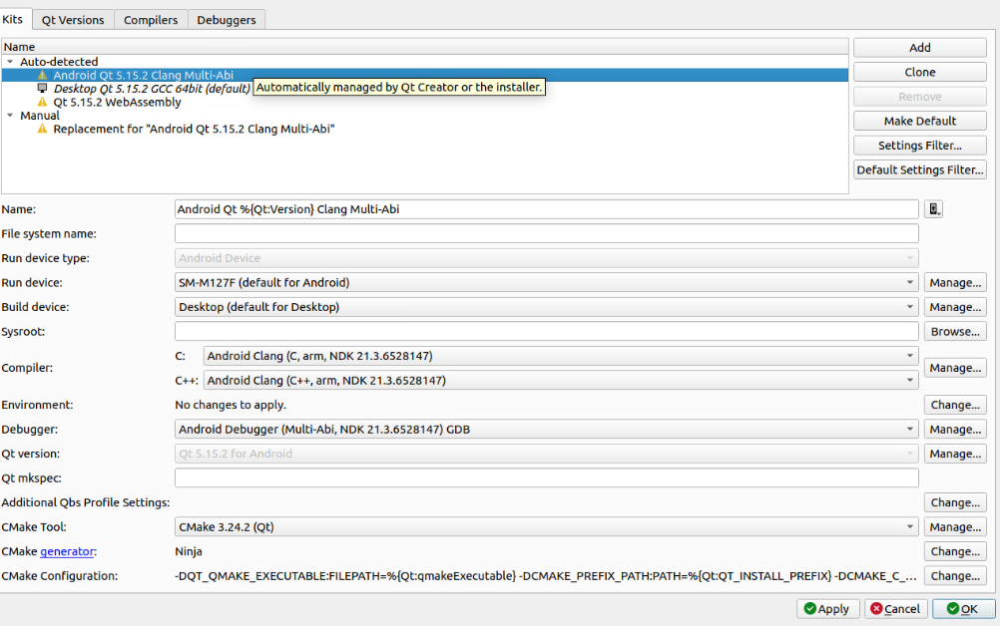
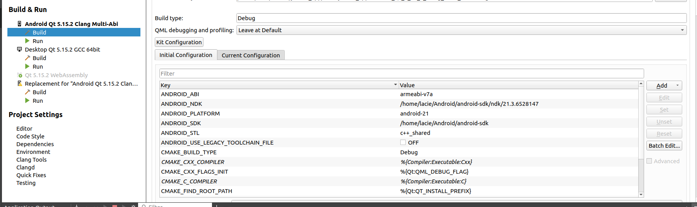

# junbot_app

# Installation

1. QMQTT
```
git clone git://code.qt.io/qt/qtmqtt.git
git checkout <version of Qt> # version of Qt: v5.15.2
sudo apt-get install qtbase5-private-dev
qmake => make => make install
```
2. Tools usage

- Install mosquitto and mosquitto-client by following this [link](https://www.digitalocean.com/community/tutorials/how-to-install-and-secure-the-mosquitto-mqtt-messaging-broker-on-ubuntu-18-04)
- Using mosquitto for sub topic in publishing.py (option)
- Config user/pass (option)
- Install paho-mqtt for run publishing.py
```
pip install paho-mqtt
```
- Default mqtt broker will be localhost:1883

3. Run

4. Android Export

4.1. System requirements

- Qt 5.15.2 (Install with Android SDK, NDK, JDK)
- Ubuntu 20.04
- Android Phone (Android 7.0 or higher)

4.2. Config Android SDK, NDK, JDK

- Install openjdk-11-jdk

```
sudo apt-get install openjdk-11-jdk openjdk-11-jre
sudo apt-get install openjdk-11-jdk-headless openjdk-11-jre-headless
```

- Open Qt Creator => Tools => Options => Devices => Android => JDK, NDK, SDK
- Config JDK location: ```/usr/lib/jvm/java-11-openjdk-amd64```
- Config Android SDK localtion: ```/home/<user>/Android/Sdk```
- Update Android SDK by SDK Manager
- If you have error with command_line tools, download following the link they given and extract to ```/home/<user>/Android/Sdk```. Then, update Android SDK again. 


4.3. Config build kit





4.4. Build and run

- Build qtmqtt for Android Kit (Build both arm64-v8a and armeabi-v7a)
- Install qtmqtt to Android Kit: Go to build folder of qtmqtt and run 

```make install```

- Build junbot_app for Android Kit
- Run junbot_app on Android Phone

# TODO:

- [x] Clean code and build 
- [x] Add feature table and permission
- [x] Login Screen and Login feature, get data, compress to Json format and send to junbot_gui => check login status and return
- [x] Connect via MQTT Broker and visual Robot Status in Home Screen
- [x] Send control message to Robot by Json format (Update this feature in junbot_gui)
- [x] Get DeliveryTarget from junbot_gui via MQTT Broker and visual in Control Screen
- [x] Send DeliveryTarget to Robot by Json format (Update this feature in junbot_gui)
- [x] Notify robot status
- [ ] Test and fix bug

